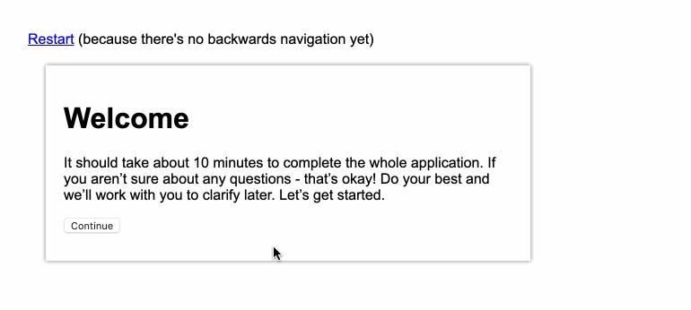
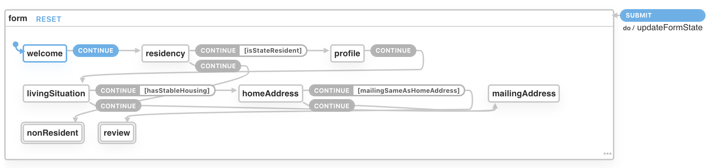

# StateX demo

This is a super simple multi-step form prototype using [StateX](https://xstate.js.org/), focusing on how StateX might be used to create a branching form experience.

**[View the demo here](https://sawyerh.github.io/statex-form-prototype/index.html)**

